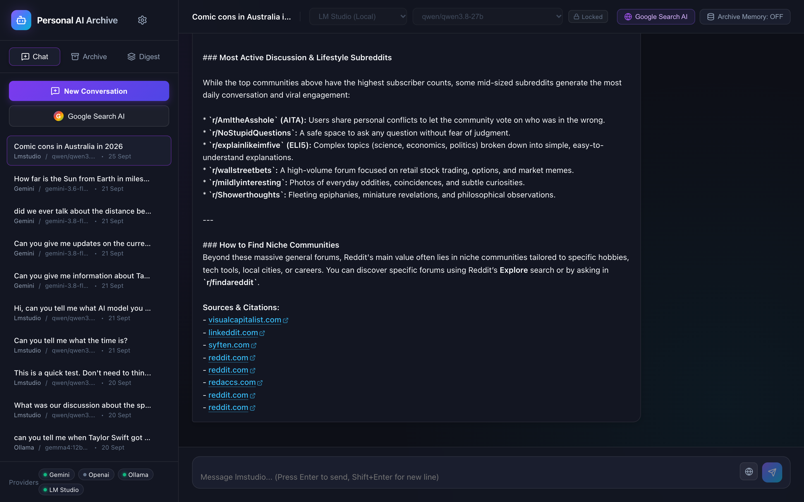
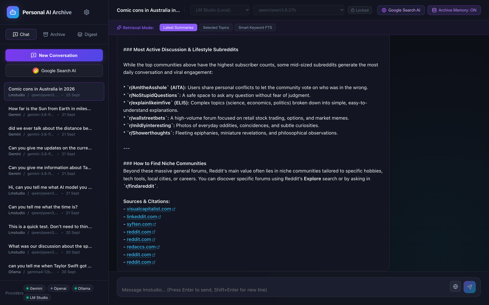
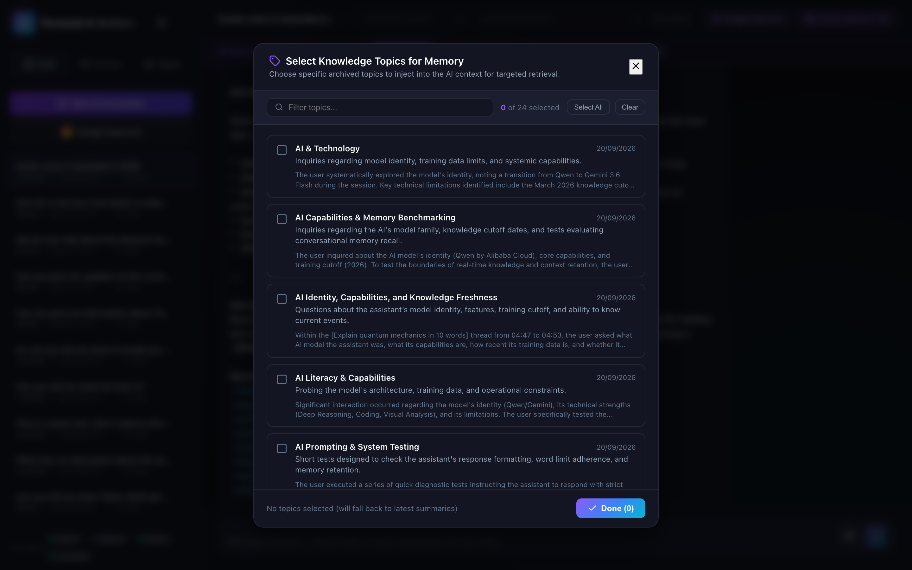
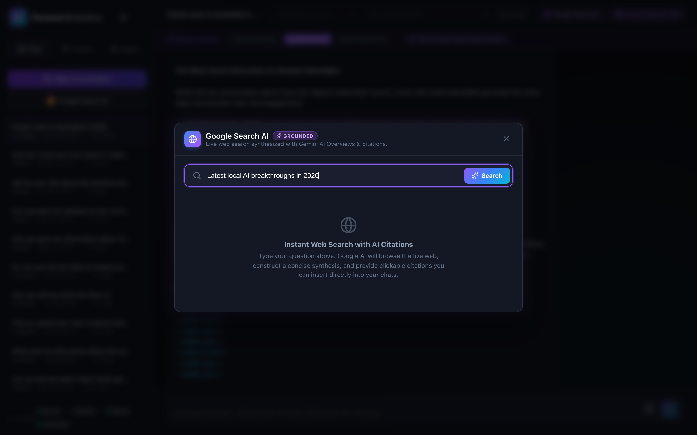
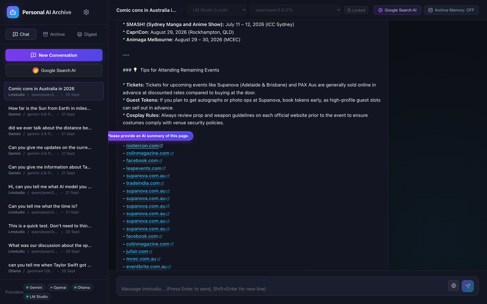
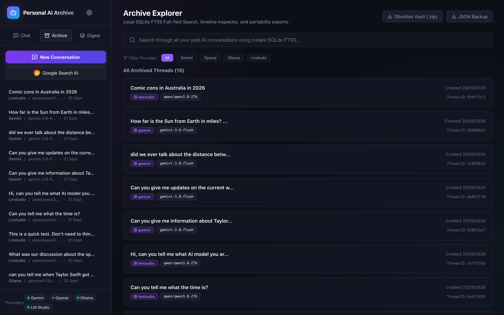
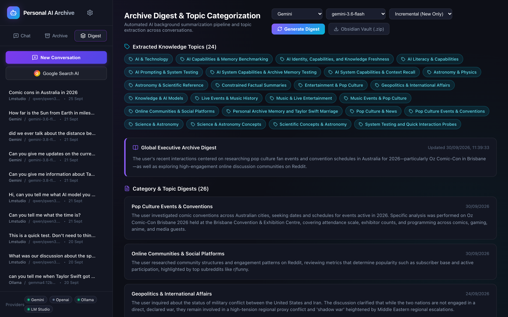
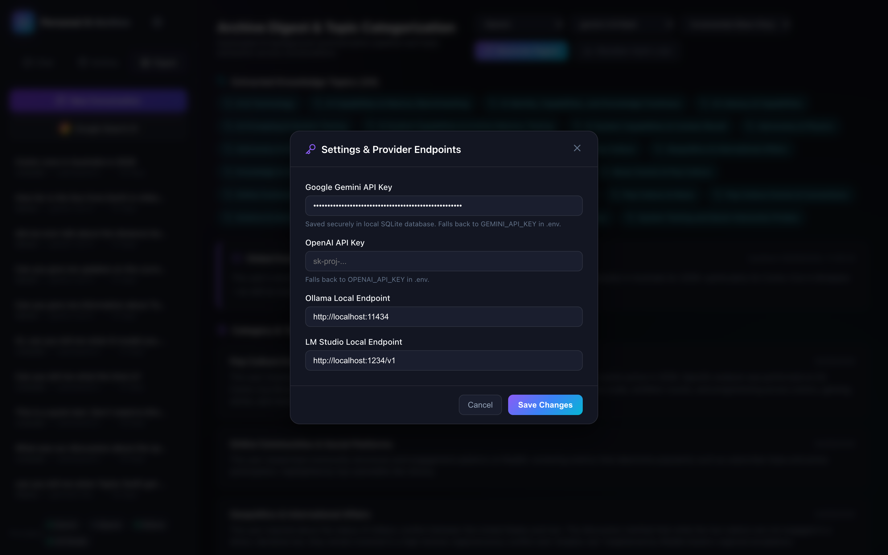

# Personal AI Archive

> **A digital second brain and research companion for storing, classifying, and searching all your private and public AI interactions.**

Personal AI Archive is a secure, local-first application providing complete data ownership for your AI chats. It connects with cloud AI providers (Google Gemini, OpenAI) and 100% offline local models (Ollama, LM Studio), automatically indexing every conversation with timestamps and metadata into a local SQLite FTS5 database.

---

## ✨ Key Features

- **Multi-Provider AI Gateway**: Seamlessly switch between Google Gemini, OpenAI ChatGPT, and offline local models (Ollama `:11434`, LM Studio `:1234`) with real-time status indicators.
- **Local SQLite & FTS5 Indexing**: All conversations are stored locally in an ACID-compliant SQLite database (`data/archive.db`) with sub-millisecond full-text search.
- **Archive Memory & Context Injection**:
  - `Latest Summaries`: Injects executive digests and category findings into ongoing prompts.
  - `Selected Topics`: Interactive topic selection modal to ground models in specific subject domains.
  - `Smart Keyword FTS`: Uses SQLite FTS5 to pull the most relevant past conversation turns into context.
- **Google Search AI Grounding**: Execute real-time web queries directly from the chat interface, receiving structured AI overviews with clickable citations.
- **Interactive Hyperlink Page Summarizer**: Hovering over any web link displays an on-demand pop-up to automatically scrape and summarize the target web page into the active chat.
- **Automated Background AI Summarizer**: Periodically digests and classifies your archive into knowledge domains, generating Markdown notes with YAML frontmatter.
- **Data Portability (Obsidian Vault & JSON)**:
  - **Obsidian Vault (.zip)**: One-click streaming download of a complete Markdown vault organized into `Summaries/` and `Conversations/`, complete with Obsidian internal wikilinks and tags.
  - **JSON Backup**: Raw relational database snapshot for complete portability.

---

## 📸 Interface Preview

### Unified Chat Workspace


### Archive Memory & Retrieval Modes


### Topic Selection Modal


### Google Search AI Dialog


### Interactive Hyperlink Hover Summarizer


### Archive Explorer & Full-Text Search


### Intelligence Dashboard & Topic Categorization


### Settings & Provider Endpoints


---

## 🚀 Quick Start

### Prerequisites
- [Node.js](https://nodejs.org/) (v18+)
- (Optional) [Ollama](https://ollama.com/) or [LM Studio](https://lmstudio.ai/) for offline local AI models.

### Installation
```bash
git clone https://github.com/DeanEGardiner/PersonalAIArchive.git
cd PersonalAIArchive
npm install
npm --prefix client install
```

### Configuration
Copy `.env.example` to `.env` (optional):
```bash
cp .env.example .env
```
*Note: API keys can also be configured securely inside the application UI under Settings and stored in your local SQLite database.*

### Running Locally
```bash
# Terminal 1: Start Backend API (runs on http://localhost:3002)
npm run server

# Terminal 2: Start Frontend Dev Server (runs on http://localhost:5173)
npm run client
```

Navigate to [http://localhost:5173](http://localhost:5173) in your browser.

---

## 🏛️ System Architecture

Refer to [`System_Architecture_and_Processes.md`](System_Architecture_and_Processes.md) for complete technical specifications, data schemas, sequence diagrams, and process workflows.

---

## 📄 License
ISC
