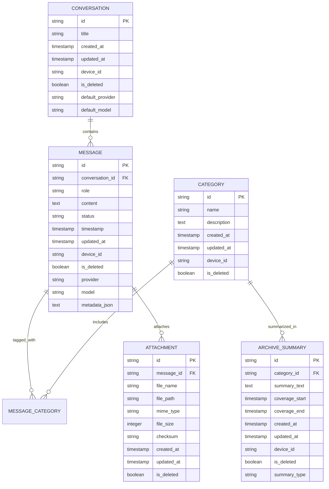
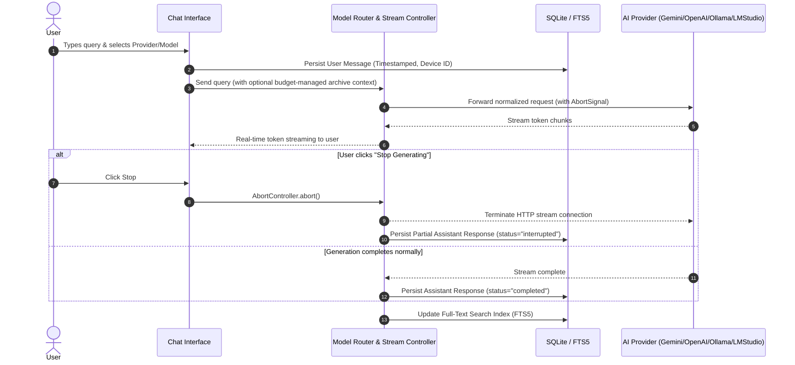
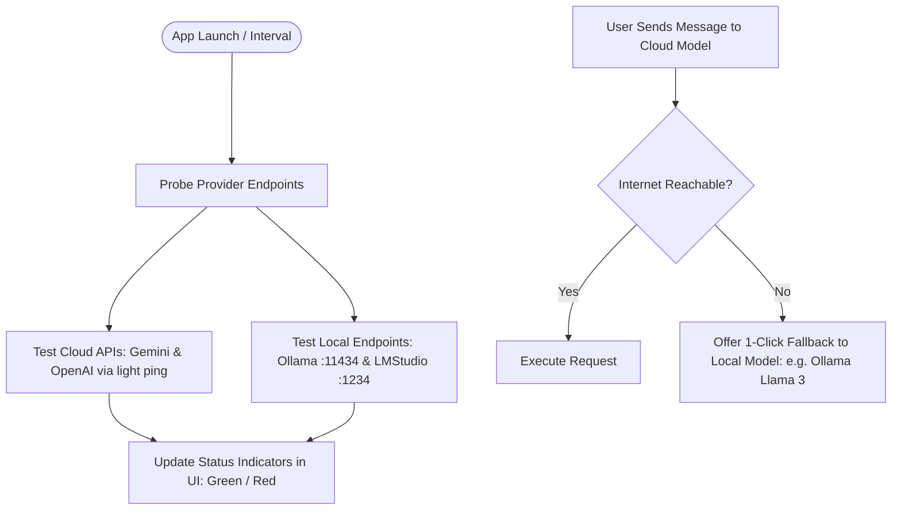
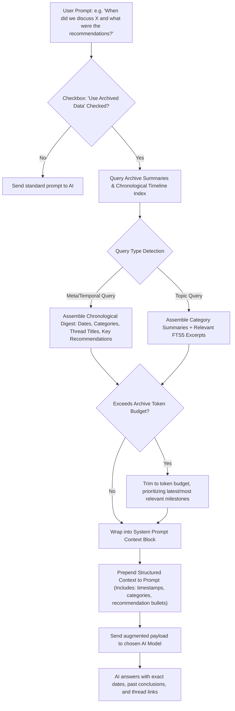
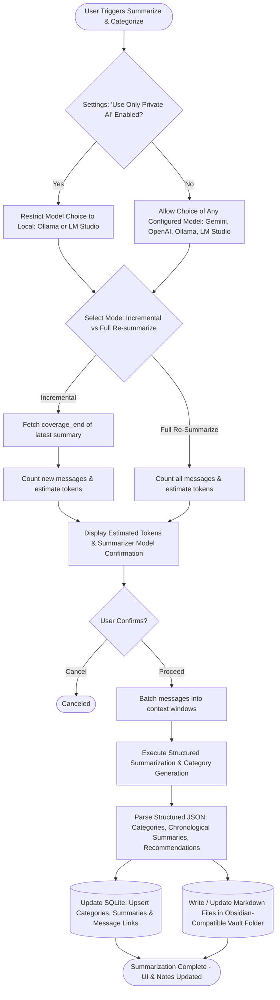
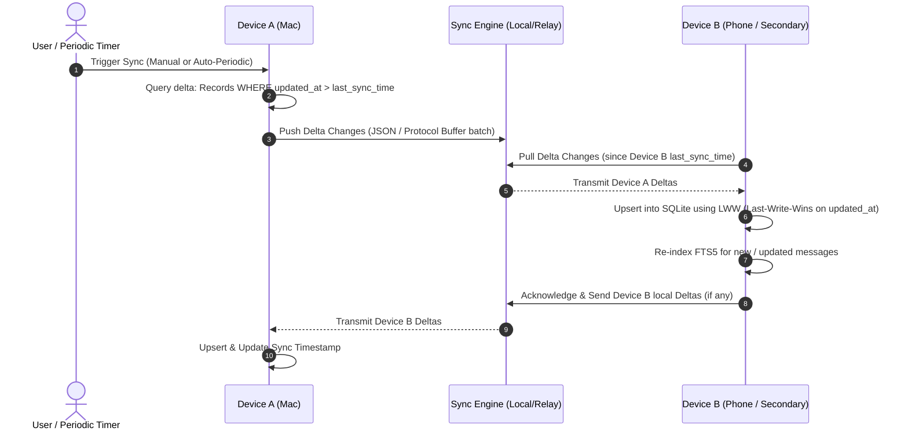

# Personal AI Archive - Architecture & System Specifications

This document outlines the complete system architecture, component breakdown, key technical processes, data design, and operational specifications for the **Personal AI Archive** application.

---

## 1. System Outline & Component Hierarchy

The application is structured into four primary layers designed for high modularity, offline-first reliability, cost control, and seamless multi-provider AI communication.

```
Personal AI Archive
├── 1. Presentation Layer (Frontend UI - React 19 + Vite @ Port 5173)
│   ├── Chat Workspace (Prompt input, streaming SSE responses, provider/model switcher, stop generation button)
│   ├── Google Search AI Integration (Live query modal, AI overview parsing, web citations, composer insertion)
│   ├── Interactive Hyperlink Summarizer (Hover tooltip: "Please provide an AI summary of this page", automatic thread response)
│   ├── Context Injection Selector (Toggle ON/OFF, 3 modes: Latest Summaries, Selected Topics Modal, Smart Keyword FTS)
│   ├── Archive Explorer (Chronological timeline, SQLite FTS5 search, provider filter, message inspector)
│   ├── Intelligence Dashboard / SummaryView (Topic categorization badges, Global Executive Digest, Category notes)
│   ├── Data Portability Hub (One-click Obsidian Vault .zip streaming export & JSON database backup)
│   └── Settings Modal (Gemini API Key, OpenAI API Key, Ollama endpoint, LM Studio endpoint, SQLite persistence)
│
├── 2. Core Service Layer (Application Engine - Node.js Express @ Port 3002)
│   ├── Model Provider Router (Standardizes payloads across Google Gemini, OpenAI, Ollama, LM Studio)
│   ├── Active Stream Controller (AbortController management for instant stop generation & partial saving with status='interrupted')
│   ├── Context Injection Engine (Dynamic retrieval: Latest Summaries, Selected Category IDs, or FTS5 snippet ranking)
│   ├── Summarization & Topic Extraction Pipeline (Incremental vs. Full re-run, Markdown file generation, SQLite updates)
│   ├── Google Search AI Integration (Live web search querying & structured markdown synthesis)
│   └── Portability & Vault Archiver (Streaming dynamic .zip via archiver with YAML frontmatter, wikilinks, and indices)
│
├── 3. Data & Storage Layer (Local Persistence & Security)
│   ├── SQLite Embedded Database (archive.db via better-sqlite3 with WAL mode enabled)
│   ├── FTS5 Virtual Index (messages_fts with automatic triggers on insert/update/delete)
│   ├── Local Summaries Vault (data/summaries/*.md generated notes with YAML frontmatter)
│   ├── Local Media Store (data/media/ for binary attachment persistence)
│   ├── Portable Backup Handler (Streaming dynamic Obsidian Vault .zip & complete JSON snapshot)
│   └── Settings Table (Encrypted local persistence for provider keys and base URLs)
│
└── 4. AI Provider Integration Layer (Adapters)
    ├── Google Gemini Adapter (@google/genai SDK, gemini-3.6-flash, 3.7-flash, 3.8-flash, 2.5-pro)
    ├── OpenAI Adapter (openai SDK, gpt-4o-mini, gpt-4o, o3-mini, gpt-4-turbo)
    ├── Ollama Adapter (Local offline REST API on default port 11434 with dynamic model discovery)
    └── LM Studio Adapter (Local offline OpenAI-compatible API on default port 1234 with dynamic model discovery)
```

---

## 2. Recommended Storage, Synchronization & Encryption Architecture

### Selection: **SQLite with FTS5 Full-Text Search + Local Blob Store + Sync Metadata**
- **Zero Configuration**: A single, local `.db` file requiring no background database servers.
- **Data Integrity & Speed**: Millisecond reads/writes, transactional safety, and native timestamp handling.
- **Search Capabilities**: SQLite's built-in `FTS5` engine allows instant keyword search across tens of thousands of conversations.
- **Local Blob Store**: Images, documents, and media are saved in a local app directory (e.g. `~/Library/Application Support/PersonalAIArchive/media/` on macOS). Only lightweight file pointers, MIME types, and thumbnail hashes are saved in SQLite, preventing database bloat.
- **Portability**: Backups can be taken via file copy, and built-in export produces an Obsidian-compatible Markdown vault with YAML frontmatter.
- **Future Extensibility**: Supports vector embeddings (e.g. via `sqlite-vec`) for semantic search.

### Multi-Platform Synchronization Architecture

To synchronize across desktop, web, and mobile platforms without requiring a central proprietary backend, the architecture supports two primary synchronization models:

1. **Local Network P2P / Direct Sync (Offline & Private)**:
   - Synchronizes devices over local Wi-Fi via mDNS / Bonjour discovery and a secure REST or WebSocket delta-sync protocol.
   - Ideal for users who keep their AI chats 100% private and offline on their local home network.
2. **Encrypted Cloud Relay / Storage Bucket (Asynchronous Multi-Device Sync)**:
   - Uses self-hosted or cloud storage (e.g. WebDAV, iCloud Drive, Google Drive, or an S3/MinIO bucket) to deposit encrypted transaction deltas / SQLite snapshots.
   - Sync works even when devices are never powered on at the same time.

#### Sync Mechanism: Timestamp-Based Delta Replication with CRDT / LWW (Last-Write-Wins)
- Every record includes a universal unique identifier (`UUIDv4`), a UTC `updated_at` timestamp, and an origin device ID (`device_id`).
- Deletions are tracked via a **soft-delete tombstone** (`is_deleted = 1`) so removals replicate cleanly without re-surfacing old records.
- Incremental sync queries only records where `updated_at > last_synced_timestamp`.

### Encryption Architecture (Post-Prototype Blueprint)

While optional in the prototype, the architecture is designed so encryption can be turned on without refactoring the application code:

1. **At-Rest Database Encryption (SQLCipher)**:
   - Transparent, page-level 256-bit AES encryption for SQLite.
   - The key is derived from a user passphrase using Argon2id / PBKDF2 and stored securely in the platform's native keychain (macOS Keychain, iOS Secure Enclave, Android Keystore).
2. **Zero-Knowledge Sync Payload Encryption**:
   - Before syncing records over the wire or pushing them to cloud storage, payloads are encrypted end-to-end (E2EE) with XChaCha20-Poly1305 or AES-256-GCM.
   - Cloud relays or file shares cannot read the conversations or metadata.

### Sync-Ready & Media-Aware Data Schema Design



---

## 3. Key Processes & Execution Flows

### Process 1: Unified Chat, Streaming Interruption & Automatic Archiving



1. **User input**: The user types a message and clicks send.
2. **Immediate local write**: The message is saved locally to SQLite with a microsecond-accurate UTC timestamp and local device ID before the network request is initiated.
3. **Normalization & Dispatch**: The Provider Router formats the conversation into the required schema for the chosen AI service.
4. **Streaming Delivery & Cancellation**: Responses stream back in real time. If the user clicks **Stop Generating**, the stream cancels immediately via `AbortController`, and whatever partial response was generated is preserved in SQLite with `status: "interrupted"`.
5. **Archive Commit**: The final or interrupted message updates the FTS index automatically.

---

### Process 2: Provider Health Probing & Offline Fallback



1. **Passive Health Check**: Probes local ports (11434, 1234) and network reachability without user friction.
2. **Status Pills**: Clear visual indicators show whether local models and cloud providers are online.
3. **Graceful Offline Fallback**: If internet connectivity drops, the app offers a one-click redirect to your local Ollama or LM Studio instance.

---

### Process 3: Token Budgeting & Archive Context Injection (Temporal & Meta-Queries)

To allow the user to ask meta-questions about past interactions (e.g., *"Have we had a previous conversation on this topic?"*, *"When was that conversation?"*, *"What were the recommendations of that conversation?"*), the context injection engine structures archive data chronologically with explicit temporal metadata and citations.



#### Active Context Retrieval Modes in UI & Engine

Users can toggle **Archive Memory: ON/OFF** in the chat header and choose between three retrieval strategies:

1. **`Latest Summaries` Mode**:
   - Injects the **Global Executive Archive Digest** along with the latest generated topic/category summaries.
   - Ideal for broad grounding across major project decisions, high-level context, and ongoing threads.
2. **`Selected Topics` Mode**:
   - Provides an interactive **Topic Selection Modal** (`TopicSelectionModal.jsx`) allowing users to check/uncheck specific extracted categories (e.g. `Astronomy & Physics`, `AI & Technology`, `Live Events & Music History`).
   - Only messages, summaries, and recommendations associated with the selected topic IDs are assembled into the context window.
   - Live badge counter displays the number of active topics (e.g., `3 topics active — Edit`).
3. **`Smart Keyword FTS` Mode**:
   - Tokenizes key search entities from the user's active prompt.
   - Executes an instant match against SQLite `messages_fts` virtual table (`MATCH ?`), extracting the highest-ranking snippet excerpts from historical user and assistant turns.
   - Highly effective for precise factual queries (e.g., specific dates, exact numbers, or unique names).

#### Grounding Schema for Injected Context
When Archive Memory is enabled, the context injection engine prepends a structured Markdown memory block:
```markdown
[ARCHIVE MEMORY CONTEXT]
The user has enabled local archive access. You have access to their historical conversation digests and timestamped milestones:

--- SUMMARY RECORD ---
- Thread ID: #conv-8492
- Category: Mobile Architecture
- Date & Time: 2026-04-12 14:32 UTC
- Title / Topic: Discussion on SQLite vs Flat File Synchronization
- Summary & Key Findings: Evaluated SQLite with FTS5 and CRDT for cross-device synchronization.
- Concrete Recommendations Made:
  1. Use SQLite with soft-delete tombstones for conflict resolution.
  2. Implement page-level SQLCipher encryption.
---

Instructions: Answer the user's inquiry referencing past dates, thread context, and specific recommendations made in previous sessions when relevant.
```

---

### Process 4: AI Summarization, Categorization & Markdown Note Sync



1. **Private AI Enforcement in Settings**:
   - When **"Use only private AI for summarization and categorization"** is enabled in Settings, the background engine strictly routes jobs to local offline instances (Ollama or LM Studio). No archive text is ever transmitted over the internet to external APIs.
2. **Dual Persistence (SQLite + Markdown Note Files)**:
   - In addition to indexing in SQLite, each category and summary is written as a clean Markdown note in a designated folder (e.g. `~/Documents/PersonalAIArchive/Summaries/`).
   - Notes include YAML frontmatter, timestamps, and backlinks:
     ```markdown
     ---
     category: "Project Planning"
     updated: "2026-09-20T13:15:00Z"
     source: "Personal AI Archive"
     ---
     # Project Planning Summary
     
     ## Timeline & Evolution
     - **2026-04-12**: Initial exploration of multi-provider AI architectures.
     - **2026-09-20**: Finalized synchronization specifications and private offline summarization.
     
     ## Key Recommendations
     - Use SQLite FTS5 for sub-millisecond local keyword indexing.
     - Isolate media binaries to local filesystem storage.
     ```
   - Notes can be opened and edited directly in **Obsidian**, **Logseq**, or standard text editors.
3. **Incremental vs. Full Updates**:
   - **Incremental**: Only processes conversations created since the last summary timestamp, updating existing category Markdown notes with fresh insights.
   - **Full Re-summarize**: Recalibrates all categories and rebuilds Markdown notes from scratch.

---

### Process 5: Multi-Platform Database Synchronization Flow



1. **Delta Extraction**: Each device queries records with an `updated_at` timestamp greater than its last known sync checkpoint.
2. **Conflict Resolution (Last-Write-Wins)**: If the same conversation or summary is modified on both devices, the record with the most recent UTC timestamp takes precedence. Because chat messages are append-only by nature, conflicts are rare.
3. **Soft-Delete Propagation**: When a conversation or message is removed, `is_deleted = 1` and a fresh `updated_at` timestamp are recorded and propagated, removing it from active views on all devices without data collision.
4. **FTS5 Re-index**: Incoming messages from other devices are automatically inserted into the local `messages_fts` index so cross-device searches are immediately available.

---

### Process 6: Data Portability & Obsidian Vault (.zip) Export

```mermaid
flowchart TD
    User([User clicks 'Obsidian Vault (.zip)']) --> Req[GET /api/export/markdown]
    Req --> Archiver[Initialize streaming ZipArchive via archiver]
    
    Archiver --> FetchSumm[Pack Summaries/ folder: data/summaries/*.md + YAML frontmatter]
    Archiver --> FetchConv[Pack Conversations/ folder: YYYY-MM-DD_Title.md notes]
    Archiver --> GenIndex[Generate Vault_Index.md & README.md with Obsidian Wikilinks]
    
    FetchSumm --> StreamOut[Stream Content-Type: application/zip]
    FetchConv --> StreamOut
    GenIndex --> StreamOut
    
    StreamOut --> ZipDownload([Download Personal_AI_Archive_Obsidian_Vault.zip])
    
    UserJSON([User clicks 'JSON Backup']) --> ReqJSON[GET /api/export/json]
    ReqJSON --> JSONBackup([Download personal_ai_archive_backup.json])
```

1. **Obsidian Vault (.zip) Streaming Generator (`/api/export/markdown`)**:
   - Streams an on-the-fly, fully populated Obsidian Vault without temporary disk bloat using Node.js `archiver` (`ZipArchive`).
   - **`Summaries/` Folder**: Packs all AI-generated global summaries (`Global_Archive_Digest.md`) and extracted category digests (`AI___Technology.md`, `Astronomy___Scientific_Reference.md`, etc.), complete with YAML headers.
   - **`Conversations/` Folder**: Converts every conversation in the archive into an Obsidian-ready note (`YYYY-MM-DD_Title.md`). Includes frontmatter tags (`#ai-archive`, topic tags), timestamped user/assistant message turns, and model badges.
   - **`Vault_Index.md` & `README.md`**: Master index note linking to every summary and conversation using Obsidian wikilinks (`[[Summaries/...]]`, `[[Conversations/...]]`).
   - Accessible via download buttons in both **Archive Explorer** (`ArchiveView.jsx`) and the **Intelligence Dashboard** (`SummaryView.jsx`).
2. **Standard JSON Backup (`/api/export/json`)**:
   - Exports the entire relational SQLite dataset (`conversations`, `messages`, `categories`, `archive_summaries`) into a single structured JSON file.
3. **Chat Import Pipeline**:
   - Designed to ingest legacy JSON chat archives (ChatGPT, Claude) and batch-index them into SQLite and FTS5.

---

### Process 7: Google AI Search Integration & Hyperlink Page Summarization

```mermaid
sequenceDiagram
    autonumber
    actor User
    participant UI as Chat Workspace & FormattedText
    participant Modal as GoogleSearchModal
    participant Server as Express Backend (:3002)
    participant Provider as AI Search Provider (Gemini / Web)

    rect rgb(20, 25, 45)
    Note over User,Provider: Flow A: Live Google Search AI Overviews
    User->>UI: Click "Google Search AI" in header / composer
    UI->>Modal: Display search modal dialog
    User->>Modal: Submits query (e.g. "Comic cons in Australia in 2026")
    Modal->>Server: POST /api/search/google { query }
    Server->>Provider: Query Google Search with grounded AI overview
    Provider-->>Server: Return synthesized answer + sources & hyperlinks
    Server-->>Modal: Return JSON response
    Modal->>UI: Insert formatted overview into composer OR post directly as thread message
    end

    rect rgb(35, 20, 45)
    Note over User,Provider: Flow B: Interactive Hyperlink Hover Summarization
    User->>UI: Hovers cursor over external hyperlink in chat bubble
    UI->>UI: Render tooltip card: "Please provide an AI summary of this page"
    User->>UI: Clicks tooltip button
    UI->>Server: POST /api/chat { text: "Please provide an AI summary of this page: <URL>", ... }
    Server->>Provider: Request URL scrape and structured summary
    Provider-->>Server: Stream summary tokens
    Server-->>UI: Real-time token streaming
    UI->>UI: Append new summary message directly into the active conversation
    end
```



1. **Google Search AI Modal**:
   - Allows users to search the live web using Google AI Search directly from within any conversation.
   - Converts raw citation URLs into interactive markdown hyperlinks.
   - Provides 1-click insertion into the chat message textarea or immediate posting as a new message bubble.
2. **Hyperlink Hover Summarizer (`FormattedText.jsx`)**:
   - Custom URL link renderer detects all web hyperlinks (`http://`, `https://`).
   - When hovered, displays an actionable pop-up button: *"Please provide an AI summary of this page"*.
   - Clicking triggers an automated AI summary query appended to the thread.

---

## 4. Current Implementation Status & Operational Runbook

### Active Port Architecture & Multi-App Topology
To run alongside companion applications (such as **Community AI Archive**), the service ports are isolated:
- **Backend API**: `http://localhost:3002` (configurable via `PORT` in `.env`, default fallback is `3002`).
- **Frontend Client (Vite Dev)**: `http://localhost:5173` (proxies `/api` and `/summaries-files` to `http://localhost:3002`).
- **Companion App (CommunityAIArchive)**: Retained on `http://localhost:3001`.
- **Local AI Endpoints**:
  - Ollama: `http://localhost:11434`
  - LM Studio: `http://localhost:1234` / `http://localhost:1234/v1`

### Directory & Storage Structure
```
/Users/deangardiner/PersonalAIArchive
├── server/
│   ├── index.js          # Express server, SSE streaming, export handlers, Vite static serving
│   ├── db.js             # SQLite init, WAL pragma, schema, FTS5 triggers
│   ├── providers.js      # Multi-model routing (Gemini, OpenAI, Ollama, LM Studio)
│   ├── summarizer.js     # Background AI summarization & Markdown note generator
│   └── contextInjector.js# Dynamic context assembly (Summaries, Topics, FTS5)
├── client/
│   ├── src/              # React 19 UI components (ChatView, ArchiveView, SummaryView, etc.)
│   ├── dist/             # Production build bundle
│   └── vite.config.js    # Dev server configuration & proxy routes
└── data/
    ├── archive.db        # SQLite database (WAL mode enabled)
    ├── summaries/        # Obsidian-compatible Markdown category notes & global digest
    └── media/            # Local binary attachment repository
```

### Operational Commands
- **Start Backend API Server**:
  ```bash
  npm run server
  ```
- **Start Frontend Dev Server**:
  ```bash
  npm run client
  ```
- **Build Frontend for Production**:
  ```bash
  npm run build:client
  ```

### Verified Implementation Checklist
- [x] Multi-Provider AI Routing (Gemini, OpenAI, Ollama, LM Studio) with live health status indicators.
- [x] Real-time token streaming with instant `AbortController` cancellation saving partial responses (`status='interrupted'`).
- [x] Context injection with 3 operational modes (`Latest Summaries`, `Selected Topics` modal, `Smart Keyword FTS`).
- [x] Automated AI background summarization pipeline (Incremental vs. Full re-run) with dual SQLite and disk Markdown persistence.
- [x] Live Google AI Search modal with citation hyperlinking and 1-click thread posting.
- [x] Interactive hyperlink hover tooltip for instantaneous on-demand web page summaries.
- [x] Full-Text Search Explorer across all conversations using SQLite FTS5.
- [x] Portable data export via dynamic Obsidian Vault (`.zip`) streaming and complete JSON snapshots.
- [x] Safe port coexistence with `CommunityAIArchive` on port `3001`.

